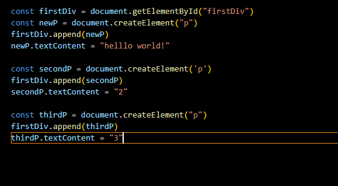
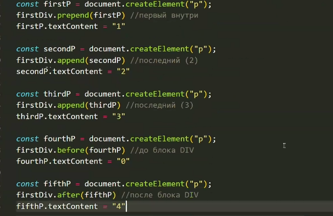

Основы JS
Программы на языке JS называются скриптами. Они могут встраиваться в html и выполняться автоматически при загрузке веб-страницы.
Скрипты распространяются и выполняются как простой текст. Основное отличие JS от других ЯП, то что скриптам не нужна специальная
подготовка или компиляция для запуска. JS работает не только с буквами и цифрами. Есть спецификая языка JS = ECMAScript. 
Это некий стандарт от разработчиков языка, в котором написано как должен реализовываться язык.

Подключить скрипт: 
<body>
    

    

    
</body>

Пример скрипта со всплывающим окном при заходе на сайт: 
alert("Hello, World!");

console.log('Hello, World') = стандартная функция вывода результата в консоль браузе

Тема 1

Операторы объявление и присваивания (ПЕРЕМЕННЫЕ):
Переменная - именнованое хранилище данных. 
Существует три основных оператора объявления переменных:
let = локальные переменные
var = глобальная переменная
const = константа (неизменяемая и непереопределяемая переменная)

Пример реализации переменной и вывода её результата

let message
message = "Hello, world!"
alert(message)

Переменные объявленые с помощью var имеют глобальную область видимости в рамках всей структуры скрипт
let и const имеют блочную область видимости и видны только в блоке кода в котором они объявлены {}

ТИПЫ ДАННЫХ 

Переменные объявленные с помощью let или var могут быть изменены в дальнейшем после объявления.
При этом стоит учитывать тип данных в переменной 

Основные типы данных:
user = 'Dmitriy'
age = 27
isAlive = true
ageTwo = 25,2 
massive = ['Dmitriy', age]
object = {name:John, ageThird:10} 
undefined 
null

ЛЕКЦИЯ 2:
Взаимодействие с пользователем. Встроенные функции браузера. (функция alert, prompt, confirm)
prompt - всплывающее окно для ввода данных с клавиатуры
confirm - всплывающее окно требующее подтверждение от пользователя

Чтоб складывать:
let a = +prompt("Введите первое число")
let b = +prompt("Введите второе число")                 без +prompt будет типо 6+7 = 67
let c = a+b
alert(c)

Явное преобразование типов данных:

let a = prompt("")
let num = Number(a)
console.log(typeof(num))                     let num = parseInt(a) = явное преобразование в целое число (5.3 = 5)

let a = +prompt("")
let num = String(a)               - String преобразует в строку
console.log(num)

Boolean - true/false

Математические операции:
let a = +prompt()
let b = +prompt()
console.log(a+b)
console.log(a-b)
console.log(a*b)
console.log(a/b)
console.log(a**b)           - в степень
console.log(a%b)            - остаток от деления

Задача:
напиши программу которая запрашивает возраст пользователя с клавиатуры, и выводит сообщение с указанием сколько будет лет пользователю через десять лет
let a = +prompt("Введите свой возраст")
let b = 10
alert(`Через 10 лет вам будет ${a+b} лет!`)

Операторы сравнения:
< 
> 
<= 
>= 
== - условие истинно если оба операнда равны и они могут быть разного типа данных
=== - идет проверка на соответствие типов данных, а так то же самое что ==
!= не равно

Условные операторы (if, else):
Условные операторы в JS позволяют выполнять различные действия в зависимости от выполнения или невыполнения определеныых условий 

ПРИМЕР СРАВНЕНИЯ ДВУХ ЧИСЕЛ:
let a = +prompt()
if (a < 5) {
    console.log(`${a} < 5`)
}

else if (a > 5) {
    console.log(`${a} > 5`)
}

else {
    console.log(`${a} = 5`)
}

Тернарный оператор:
let a = +prompt()
let result = (a > 5) ?
"a > 5" : 
"a <= 5"
console.log(result)

Логические операторы:
&& -  логическое и  (с точки зрения математики умножение)
|| - или (сложение)
! - не (отрицание)

Напишите программу которая запрашивает у пользователя число и проверяет принадлежит ли это число диапозону от 10(включительно) и до 100
let a = +prompt("Введите ваше число в диапозоне от 10 до 100")
if (a >=100) {
    console.log("Слишком много")
}

else if (a<10) {
    console.log("Слишком мало")
}

else {
    console.log("Находится")
}

можно еще if (a>=100 && a < 100 ) {
    console.log("Находится)
}
else {
    console.log("Не находится")
}

Задачки на дом: 
1. с клавиатуры вводятся две перменные, логин и пароль, если логин равен admin, а пароль равен password, консоль выводит доступ разрешён
если что то не подходит, то пишет что отказано в доступе

2. с клавиатуры вводятся две координаты (x, y) в консоли должен отобразиться результат в какой координатной четверти лежит данная точка

3. напишите программу которая запрашивает длины трех сторон треугольника и выводит сообщение о типе треугольника

ЦИКЛЫ WHILE и FOR

При написании скриптов зачастую дают действия сделать действия много раз
По типу перебрать числа от 1 до 10 и перебрать для каждого каждый кода

while (пока условие истино) (блок кода )

let i = 0;
while (i < 10) {
    alert(i)
    i++
}

Конструкция do while
do - блок кода выполнитсяя гарантированно один раз
while - если условие истино

let i = 0;

do {
    alert(i)
    i++

}
while (i < 0) {
}

Оператор for (инициализация; условие; действие)

for ( let i = 0; i < 10; i++) {
    alert (i)
}

Задачи:
Напишите программу, которая запрашивает у пользователя число и выводит сумму всех чисел от 1 до этого числа с использованием цикла for

let num = +prompt("Введите число")
let sum = 0;
for (let i = 1; i <= num; i++) {
    sum+=i;
    alert(sum);
}

Прерывание цикла BREAK и продолжение CONTINUE

Обычно цикл завершается при ложности условия, но бывает ситуация когда 
из цикла нужно выйти в определенный момент и это реализуется с помощью
оператора BREAK

let sum = 0

while (true) {
    let value = +prompt("Введите число")
    if (!value) break; // если значение не получено то выходим из цикла

    sum = sum + value
}
console.log(sum)

CONTINUE 
при использовании этого оператора цикл не пререывается а переходит к 
следующей итерации если условие все еще = true
for (let i = 0; i < 10; i++) {
    if (i % 2 == 0) continue
        alert(i)
}

Конструкция switch, case

switch(a) {
    case ...:
    console.log('')

    case ...:
    console.log
    break

}

Используется как замена if else и в случае замены выражений

Пользователь вводит число с клавиатуры. Если число равно 3
то программа выводит результат мало. Еслли число равно 4, то
результат в точку. Если число равно 5, то результат в точку
если 6 - много
если другое - мимо

let a = +prompt("Введите ваше число")
switch (a) {
    case 3:
        console.log("мало")
        break
    case 4:
    case 5:
        console.log("В точку")
        break
    case 6:
        console.log("Много")
        break
    default:
        console.log("Мимо")
        break
}

функции

1 - метод function declorattion
function sum () { //объявление функции с параметрами (или без)
    блок кода функции (callback)
}

sum() //вызов функции

function sum (a, b) {
    return a + b
}
console.log (sum(3, 4))

2. Function Expression.
let sum = function(a, b) {
    return a + b
}
console.log(())

3. arrow function
let sum = (a, b) => {

}
console.log(sum(3,4))

Параметры функции.
1. Объявление функции function sum (a,b) или
let sum = function (a,b)
let sum = (a, b) =>  a+b

let age = +prompt("Введите ваш возраст")
let welcome = (age > 18) ? function() {
    alert("Совершеннолетний")
} !
function() {
    alert("Несовершеннолетний")
}

ОБЪЕКТЫ

let user = {
    name = "Ivanov",
    age 30,
    number: 3252345;
}

alert(user.name) (либо также .age и тд), получаем значение свойств объекта

const user = {
    name = "Ivanov",
    age 30,
    number: 3252345;
}

let key = prompt("Что вы хотите узнать о пользователе?")
console.log(user(key))

могут быть также пустые значения

user.name = "Petrov"

alert(user.name) - увидится Petrov, сам объект константа - но внутри него можно все менять

Объект по сути это некий ящик, как папка(контейнер), и они подписаны

function makeUser (name, age) {
    return {
        name: name,
        age: age
    }
}

let user = makeUser("Ivanov", 30)
console.log(user.name)

let user = {
    name = "Ivanov"
    age: 30;

}
user["phone"] = "3213352335"
delete user["name"] // удаление свойств в объекте

console.log("name" in user)
console.log(user.phone)

МАССИВЫ!!! ВАЖНО!!!!

Это объект для упорядовачивания нескольких значений
Каждый элемент массива имеет свой индекс (с 0)

let array = [1, "hello", true, 3.14]
console.log(array)[0] - указываем значение индекса и получаем 1

метод push() - добавляет элемент в конец массива
array.push(5) - удаляет последний элемент массива
array.shift() - удаляет первый элемент массива
array.unshift("world" - добавляет первый элемент)
indexOf() - возвращает индекс найденного элемента

array.pop()
    console.log(array.indexOf("hello"))

const array = [-3, 0, 2, 10] //filter() - возвращает новый массив содержащий элементы
// которые выполняютт условие
// фильтрация массива в положительные числа
const newArray = array.filter(function (element) {
    if (element >= 0) {

        return true;

    }
    else {
        return false;
    }

})

console.log(array)
console.log(newArray)

const array = [-3, 0, 2, 10, "hello", function func(){alert("hello, world")}]

array[5]() - вызов функции из массива

const arrayFirst = [-3, 0, 2, 10, "hello"]
const arraySecond = [5, 1, "world"]
const arrayThird = [12, 15, 22]
// слияние и срез массивов
// concat()
//slice()
const  arrayMerged = arrayFirst.concat(arraySecond).concat(arrayThird)
console.log(arrayMerged)

const arrayFirst = [-3, 0, 2, 10, "hello"]
const arraySecond = [5, 1, "world"]
const arrayThird = [12, 15, 22]
// слияние и срез массивов
// concat()
//slice()
const newArray = arrayFirst.slice(2)
console.log(newArray)

const arrayFirst = [-3, 0, 2, 10, "hello"]
const arraySecond = [5, 1, "world"]
const arrayThird = [12, 15, 22]
// слияние и срез массивов
// concat()
//slice()
const newArray = arrayFirst.slice(2, 3) // оставляет все со второго индекса до третьего, первый элемент захватывает, второй срезает
console.log(newArray)

// Объекты
// функция внутри объекта называется методом
// this - берет значение из переменной объекта
const user = {
    name: prompt("Введите свое имя"),
    age: 20,
    hello: function(){
        alert(this.name)
    }
}

user.hello()

const user = {
    name: "Ivanov",
    age: 20,
}

const clone = {} // добавляем пустой объект clone
for(let key in user) { // переебор свойств объекта
    clone[key] = user[key];
}
// clone.name="Petrov"
clone['name'] = 'Petrov'
console.log(user.name)

console.log(clone.name)

const clone = {} // добавляем пустой объект clone
for(let i in user) { // переебор свойств объекта
    clone[i] = user[i];
}
// clone.name="Petrov"
clone['email'] = '@mail.ru'
console.log(user.name)

console.log(Object.keys(clone).length) // выведем  количество свойстввв вв объекте

//document.getElementById("id элемента")
const clicker = () => {
    const firstDiv = document.getElementById("firstDiv")
    firstDiv.style.background = 'red';
    firstDiv.style.fontSize = '30px';
}

//document.querySelector(".#") - находит первый класс или айди из кода и применяет к нему свойства
const firstDddiv = document.querySelector("#firstDiv") // если class - используем точку вместо #
firstDiv.style.background = 'red'

const divs = document.querySelectorAll("div");  - выбираем все элементы, в виде МАССИВА и помогает нам для каждого дива применить какую то функцию
divs.forEach(div => console.log(div.textContent));
console.log(divs.length) - считаем кол-во блоков div

## Пример добавления контента с помощью js в другие div

Добавляем после div

делаем с помощью цикла кучу дивов

Задаеем стили через css внутри js

А теперь же с помощью функции по клику меняем стили

tailwind и bootstrap дляяя ознакомления